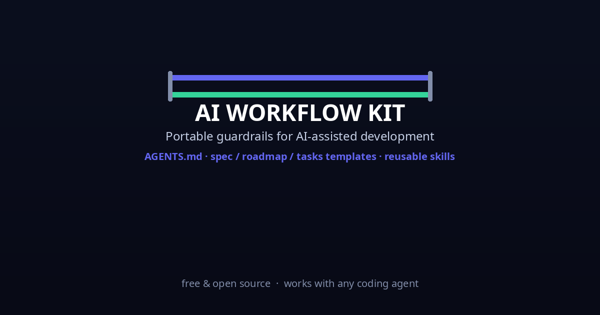

<!-- Public edition of the AI Workflow Kit. See AGENTS.md for usage. -->

# AI Workflow Kit

<p align="center">
  
</p>

Portable guardrails for AI-assisted development, based on the Chris Titus
workflow: *define the project, build the guardrails, work in small phases, and
stop at manual gates.*

Plain-text files + reusable skills. No model, plugin, or subscription
dependency — the tool is replaceable, the gates are not. Works with Freebuff,
Codex, Claude Code, or a team of humans on any machine.

## What's inside

```
ai-workflow-kit/
├── AGENTS.md               Global instructions — how the agent works (baseline)
├── templates/
│   ├── SPEC.md.tmpl        What the project must do + acceptance criteria
│   ├── ROADMAP.md.tmpl     Phases with exit criteria
│   └── TASKS.md.tmpl       Small jobs inside the current phase
├── skills/
│   ├── bash-validation/        Shell script safety checks          [global]
│   ├── cloudflare-pages-wrangler/  Production deploy + verify      [project]
│   ├── docker-compose-<your-server>/   Compose + stale-mount recovery  [project]
│   ├── secrets-env-discipline/      Keys, .env, rotation rules      [global]
│   ├── nextjs-validation/          tsc --noEmit + build + lint     [global]
│   ├── python-pil-assets/          Image generation + verification  [project]
│   ├── node-express-api/           API conventions                  [global]
│   ├── stripe-billing/             Price IDs, webhooks             [global]
│   ├── clerk-auth/                 Per-app keys + tier gating      [global]
│   ├── git-conventions/            Commit style + ask-before-push  [global]
│   └── ssh-<your-server>-deploy/      rsync → compose → curl verify   [project]
├── docs/PORTABILITY.md      Copy-paste commands for moving the kit
├── install.sh               One-line installer (jump drive or tailnet)
├── setup.sh                 Bootstrap: project mode or --global mode
└── README.md
```

## Quickstart (portable to any computer)

```bash
# 0. Install the agent once per machine (requires Node.js)
npm install -g freebuff

# 1. Get the kit (clone or copy the tarball — works on Linux/Windows/Mac)
git clone <private-gitea-url>/gus/ai-workflow-kit.git
# or: tar xzf ai-workflow-kit.tar.gz

# 2a. Bootstrap a project (guardrails apply inside that repo)
./ai-workflow-kit/setup.sh ~/path/to/your-project

# 2b. OR install system-wide (guardrails apply to every session)
./ai-workflow-kit/install.sh   # checks the agent, then setup.sh --global

# 3. Fill in SPEC.md + ROADMAP.md, then start the agent:
#    "Read AGENTS.md and SPEC.md, then propose the first phase of ROADMAP.md."
```

`setup.sh` never overwrites existing files — it only adds what's missing.
`install.sh` refuses to run if no agent is installed (see PORTABILITY.md step 0).

## Project mode vs global mode

- **Project mode** (`setup.sh <dir>`) — copies `AGENTS.md`, scaffolds
  `SPEC.md`/`ROADMAP.md`/`TASKS.md`, and installs ALL skills into
  `<dir>/.agents/skills/`. Best for project-specific rules and architecture.
- **Global mode** (`setup.sh --global`) — installs guardrails system-wide:
  `~/.agents/AGENTS.md` + only the **scope: global** skills, and mirrors into
  other agents' config dirs when present (`~/.claude/CLAUDE.md`, `~/.codex/AGENTS.md`).
  Best for behavior rules that must never be forgotten (secrets discipline,
  ask-before-push).

### Skill scoping

Each `SKILL.md` declares `scope: global` or `scope: project` in its frontmatter:

- **global** (7) — behavior rules that apply everywhere: bash-validation,
  secrets-env-discipline, git-conventions, nextjs-validation,
  node-express-api, stripe-billing, clerk-auth. Installed by `--global`.
- **project** (4) — tied to specific machines/projects: cloudflare-pages-wrangler,
  docker-compose-<your-server>, ssh-<your-server>-deploy, python-pil-assets.
  Installed only by project mode (they only belong on machines that use them).

They layer: global rules apply everywhere; a project's own `AGENTS.md` adds
that repo's specifics on top. Project wins on specifics, global wins on
behavior.

## The workflow (the short version)

```
Global instructions + reusable skills
  -> repository spec and roadmap
  -> test and validation scaffolding
  -> one small implementation phase
  -> local tests and review
  -> pull request and CI
  -> independent review
  -> fix, retest, resolve feedback
  -> manual verification
  -> merge
```

AI makes each step faster. It does not get to skip any of them.

## Writing skills

Skills are folders with a `SKILL.md` (YAML frontmatter: `name` + `description`,
then instructions) plus any supporting scripts. They install into a project's
`.agents/skills/` directory. Capture anything the agent keeps getting wrong —
validation quirks, unusual linting rules, environment-specific gotchas. Each
skill in this kit encodes a real incident from the workspace (the wrangler
preview-vs-production trap, the Jellyfin stale bind-mount, the strict-mode
typecheck failure, the leaked-key rotations).

## Adjusting the guardrails

- Don't like a rule? Delete it.
- Agent repeats a mistake? Add a more precise rule to `AGENTS.md` or the
  relevant skill.
- These files serve you, not the other way around.

## License / secrets

Keep this kit free of secrets. Do not commit tokens, keys, or client data —
the `.gitignore` in this repo excludes nothing by default; if you add sensitive
material, add it to `.gitignore` first.

---

*Part of the [CyberGlobal](https://<your-domain>) tiny-tools series — small,
useful, privacy-first software. (See also [sweep-lite](https://github.com/<your-github-username>/sweep-lite)
and [gmail-organizer](https://github.com/<your-github-username>/gmail-organizer).)*
